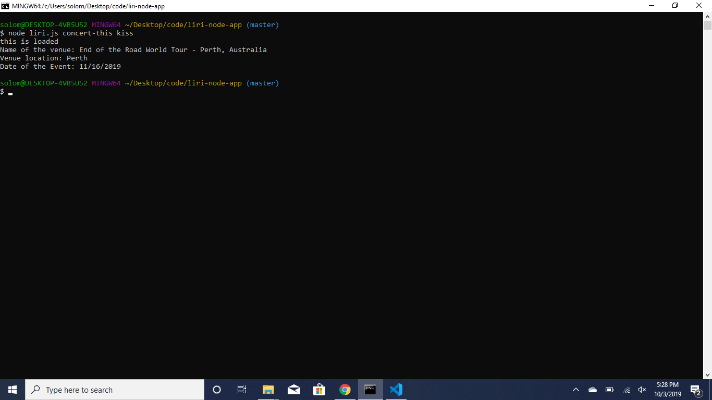

# liri-node-app

LIRI is a command line node app that takes in parameters and gives you back data based off the following parameters: 

-	concert-this
-	Spotify-this-song
-	movie-this
-	do-what-it-says

## concert-this: 

